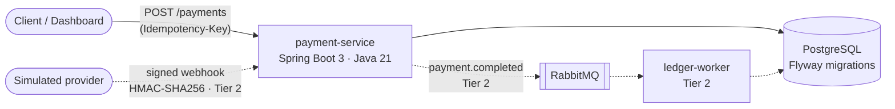

# PayFlow

A Spring Boot payment + double-entry wallet service: create a payment, and the service posts
balanced DEBIT/CREDIT ledger entries whose signed sum is always exactly zero.

> Rebuilt from an architecture I first shipped in Node/Express (idempotent Stripe webhooks,
> queued jobs, payments) to learn how the same design maps onto Spring Boot: dependency
> injection instead of manual wiring, JPA instead of Mongoose, and declarative transaction
> boundaries instead of manual session handling.

## Architecture



*Solid lines are live today (Tier 1); dashed lines land in Tier 2, when ledger posting moves
from the API process into `ledger-worker` behind RabbitMQ.*

## Live demo

- **Swagger UI:** https://payflow-api-zkxz.onrender.com/swagger-ui.html
- **API base:** https://payflow-api-zkxz.onrender.com — try `GET /api/v1/wallets`, then create a
  payment against one of the wallet ids with any `Idempotency-Key`
- ⚠️ The backend runs on a free tier that sleeps when idle — the **first request can take
  30–50 s** to wake it. That is the hosting plan, not the app.

## Status

| Tier | Scope | State |
|---|---|---|
| 1 | REST API, PostgreSQL + Flyway, idempotent payment creation, RFC 7807 errors, Swagger, Docker, Render deploy | ✅ **live** (Render + Neon) |
| 2 | Spring Security + JWT, RabbitMQ ledger worker + DLQ, HMAC-SHA256 webhooks, AES-GCM at rest | ⏳ not started |
| 3 | Testcontainers + REST Assured + JaCoCo + CI badge, Next.js dashboard on Vercel | ⏳ not started |

## Run it locally

```bash
docker compose up -d          # Postgres + RabbitMQ
mvn -pl payment-service spring-boot:run
```

Then open http://localhost:8080/swagger-ui.html.

No Docker? Run against in-memory H2 (PostgreSQL mode) instead:

```bash
mvn -pl payment-service spring-boot:run -Dspring-boot.run.profiles=dev
```

Demo wallets are seeded on first boot; `POST /api/v1/demo/reset` reseeds at any time.

## How the interesting parts work

### Idempotency (`Idempotency-Key` header)

`POST /api/v1/payments` requires an `Idempotency-Key`. Before executing, the service inserts a
**claim row** keyed by that value — the primary key is the race arbiter, so a concurrent
duplicate cannot execute the payment twice. Replaying the same key with the same body (compared
by SHA-256 of the canonical JSON) returns the originally stored response with
`Idempotency-Replayed: true`; the same key with a different body is rejected with `409`.
A failed execution releases the claim so the client can safely retry.

### The double-entry invariant

Every payment posts exactly two ledger entries in one transaction: a DEBIT against the internal
treasury wallet and a CREDIT to the customer wallet. With CREDIT positive and DEBIT negative,
the signed sum per payment must be **exactly zero** — asserted in code after every posting and
in the test suite. Wallet rows use optimistic locking (`@Version`), and balances always equal
the signed sum of their entries.

### Errors

All errors are RFC 7807 problem details via `@RestControllerAdvice` — validation failures list
per-field errors, and nothing internal (no stack traces) ever reaches a client.

### Coming in Tier 2 *(not built yet — honestly labelled)*

Webhook HMAC-SHA256 verification (constant-time compare, stale-timestamp rejection), AES-GCM
encryption at rest for the card reference column, and the RabbitMQ `payment.completed` event
consumed by `ledger-worker` with retry + dead-letter queue.

## API

```
POST /api/v1/payments               # requires Idempotency-Key header
GET  /api/v1/payments/{id}
GET  /api/v1/wallets
GET  /api/v1/wallets/{id}
GET  /api/v1/wallets/{id}/transactions
POST /api/v1/demo/reset
GET  /health
```

## Tests

```bash
mvn verify
```

Unit tests cover the ledger invariant and the idempotency contract; an integration test drives
the full HTTP flow (create → replay → conflict → ledger check) against Flyway-migrated H2 in
PostgreSQL mode. Testcontainers against real Postgres + RabbitMQ arrive in Tier 3 alongside
REST Assured and a JaCoCo coverage badge.
