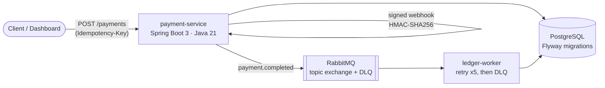

# PayFlow

A Spring Boot payment + double-entry wallet service: create a payment, a simulated provider
confirms it through an HMAC-signed webhook, a `payment.completed` event goes through RabbitMQ,
and a separate worker posts balanced DEBIT/CREDIT ledger entries whose signed sum is always
exactly zero.

> Rebuilt from an architecture I first shipped in Node/Express (idempotent Stripe webhooks,
> queued jobs, payments) to learn how the same design maps onto Spring Boot: dependency
> injection instead of manual wiring, JPA instead of Mongoose, and declarative transaction
> boundaries instead of manual session handling.

## Architecture



The provider is simulated in-process but talks to the API the honest way: over real HTTP with a
signed webhook. Payments are `PENDING` until the ledger is posted — the same asynchronous shape
a real payment system has.

## Live demo

- **Swagger UI:** https://payflow-api-zkxz.onrender.com/swagger-ui.html
- **API base:** https://payflow-api-zkxz.onrender.com — try `GET /api/v1/wallets`, then create a
  payment against one of the wallet ids with any `Idempotency-Key`, and watch it flip from
  `PENDING` to `COMPLETED`
- ⚠️ The backend runs on a free tier that sleeps when idle — the **first request can take
  30–50 s** to wake it. That is the hosting plan, not the app.

## Status

| Tier | Scope | State |
|---|---|---|
| 1 | REST API, PostgreSQL + Flyway, idempotent payment creation, RFC 7807 errors, Swagger, Docker, Render deploy | ✅ **live** (Render + Neon) |
| 2 | JWT auth, HMAC-SHA256 webhooks, RabbitMQ + ledger-worker + DLQ, AES-GCM at rest | ✅ **live** (Render + CloudAMQP) |
| 3 | Testcontainers + REST Assured + JaCoCo + CI badge, Next.js dashboard on Vercel | ⏳ not started |

## Run it locally

```bash
docker compose up -d                                  # Postgres + RabbitMQ
mvn -pl payment-service spring-boot:run               # the API        :8080
mvn -pl ledger-worker spring-boot:run                 # the consumer   :8081
```

Then open http://localhost:8080/swagger-ui.html.

No Docker? The dev profile runs the **entire flow** (H2 in PostgreSQL mode, ledger posted
in-process instead of via the broker):

```bash
mvn -pl payment-service spring-boot:run -Dspring-boot.run.profiles=dev
```

Demo wallets are seeded on first boot. Admin login for the protected endpoints in dev:
`admin` / `demo-admin`.

## How the interesting parts work

### Idempotency (`Idempotency-Key` header)

`POST /api/v1/payments` requires an `Idempotency-Key`. Before executing, the service inserts a
**claim row** keyed by that value — the primary key is the race arbiter, so a concurrent
duplicate cannot execute the payment twice. Replaying the same key with the same body (compared
by SHA-256 of the canonical JSON) returns the originally stored response with
`Idempotency-Replayed: true`; the same key with a different body is rejected with `409`.
A failed execution releases the claim so the client can safely retry.

### Webhook verification (HMAC-SHA256)

The provider signs `timestamp + "." + body` with a shared secret; the signature and timestamp
travel in `X-Webhook-Signature` / `X-Webhook-Timestamp` headers. Verification recomputes the
HMAC and compares with **`MessageDigest.isEqual`** — constant-time, so timing can't leak how
many bytes matched. Timestamps outside a ±5 minute window are rejected before any crypto, which
kills replay attacks; because the timestamp is inside the signed content, it can't be re-dated.

### The queue, retries and the dead-letter queue

Webhook confirmation publishes `payment.completed` to a durable **topic exchange**;
`ledger-worker` consumes it from a queue configured with a dead-letter exchange. A failing
message is retried **5 times with exponential backoff (1s → 10s)**; when retries are exhausted
it is rejected without requeue and lands in the DLQ instead of spinning forever. Posting is
idempotent (existing entries for a payment short-circuit), so RabbitMQ's at-least-once delivery
can never double-book a wallet.

### The double-entry invariant

Every payment posts exactly two ledger entries in one transaction: a DEBIT against the internal
treasury wallet and a CREDIT to the customer wallet. With CREDIT positive and DEBIT negative,
the signed sum per payment must be **exactly zero** — asserted in code after every posting and
in the test suite. Wallet rows use optimistic locking (`@Version`), and balances always equal
the signed sum of their entries.

### AES-GCM encryption at rest

The (simulated) card reference column is encrypted transparently by a JPA `AttributeConverter`:
AES-256-GCM, a fresh random 12-byte IV per value (stored alongside the ciphertext), 128-bit
auth tag. The key comes from an env var — base64 256-bit, or any string derived through
SHA-256 — and never appears in source or in the database.

### Auth

Stateless JWT (HS256): `POST /api/v1/auth/login` returns an access + refresh pair; refresh
tokens are single-purpose (`token_use` claim) and can't be used as access tokens. Read
endpoints and payment creation stay public — this is a portfolio demo — while destructive
admin operations (`/api/v1/demo/reset`) require the ADMIN role via `Authorization: Bearer`.

### Errors

All errors are RFC 7807 problem details via `@RestControllerAdvice` — validation failures list
per-field errors, and nothing internal (no stack traces) ever reaches a client.

## API

```
POST /api/v1/payments               # requires Idempotency-Key header
GET  /api/v1/payments/{id}
GET  /api/v1/wallets
GET  /api/v1/wallets/{id}
GET  /api/v1/wallets/{id}/transactions
POST /api/v1/webhooks/provider      # HMAC-SHA256 signed
POST /api/v1/auth/login             # → JWT access + refresh
POST /api/v1/auth/refresh
POST /api/v1/demo/reset             # admin only
GET  /health
```

## Tests

```bash
mvn verify
```

Unit tests cover the ledger invariant, idempotency contract, HMAC signature scheme and the
AES-GCM converter (round-trip, tamper detection, fresh IVs). Integration tests drive the full
async HTTP flow — create → provider webhook → ledger posted — plus tampered/stale webhook
rejection and the JWT auth flow, against Flyway-migrated H2 in PostgreSQL mode. Testcontainers
against real Postgres + RabbitMQ arrive in Tier 3 alongside REST Assured and a JaCoCo coverage
badge.
